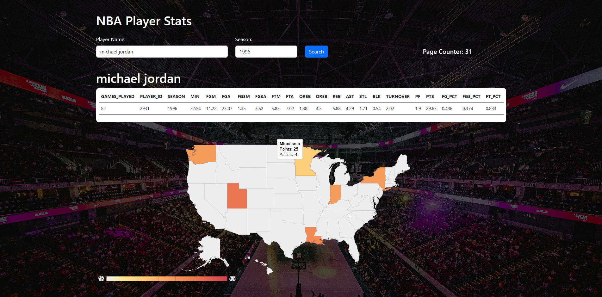
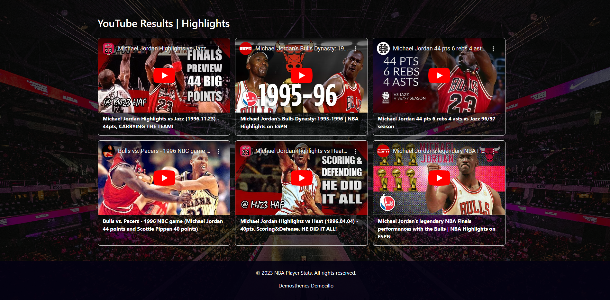

# NBA Stats Heatmap with YouTube Highlights Integration

Combine NBA player statistics from the balldontlie API with the Google GeoChart Visualization API to create an interactive heatmap. This heatmap represents NBA player performance by season averages, and when clicked, it searches for YouTube highlights related to the displayed data.

## Introduction

This project is an exciting mashup of the balldontlie API and the Google GeoChart Visualization API, with an added YouTube Data API integration. It allows you to explore and visualize NBA player performance over time using an interactive heatmap. When you click on a specific data point on the heatmap, it automatically searches YouTube for highlights related to the displayed player's performance.

##

##

## Features

- Retrieve NBA player statistics using the balldontlie API.
- Create an interactive heatmap using the Google GeoChart Visualization API.
- Display player performance data on the heatmap, including season averages.
- Seamlessly integrate YouTube Data API to search for highlights.

### How It Works

1. Input a player's name and the season you want to analyze.
2. The balldontlie API fetches the player's statistics for the specified season.
3. The Google GeoChart Visualization API paints the heatmap, representing player performance data by region.
4. When you click on a heatmap region, the YouTube Data API searches for relevant highlights based on the player's name, team, points, date, and assists from that region.

Explore NBA player performance like never before with this dynamic heatmap, and relive the most exciting moments with instant access to YouTube highlights.

## Getting Started

### Prerequisites

- Ensure you have access to the balldontlie API (It's free)
- Set up a Google GeoChart Visualization API key.
- Obtain YouTube Data API credentials.

### Installation

1. Clone the repository.
2. Configure API keys and credentials in the project.
3. Run the application.

## Usage

1. Enter a player's name and the desired season.
2. Explore the heatmap to visualize player performance.
3. Click on a region to watch related YouTube highlights.

## Acknowledgments

- [balldontlie API](https://www.balldontlie.io/)
- [Google GeoChart Visualization API](https://developers.google.com/chart/interactive/docs/gallery/geochart)
- [YouTube Data API](https://developers.google.com/youtube/)
